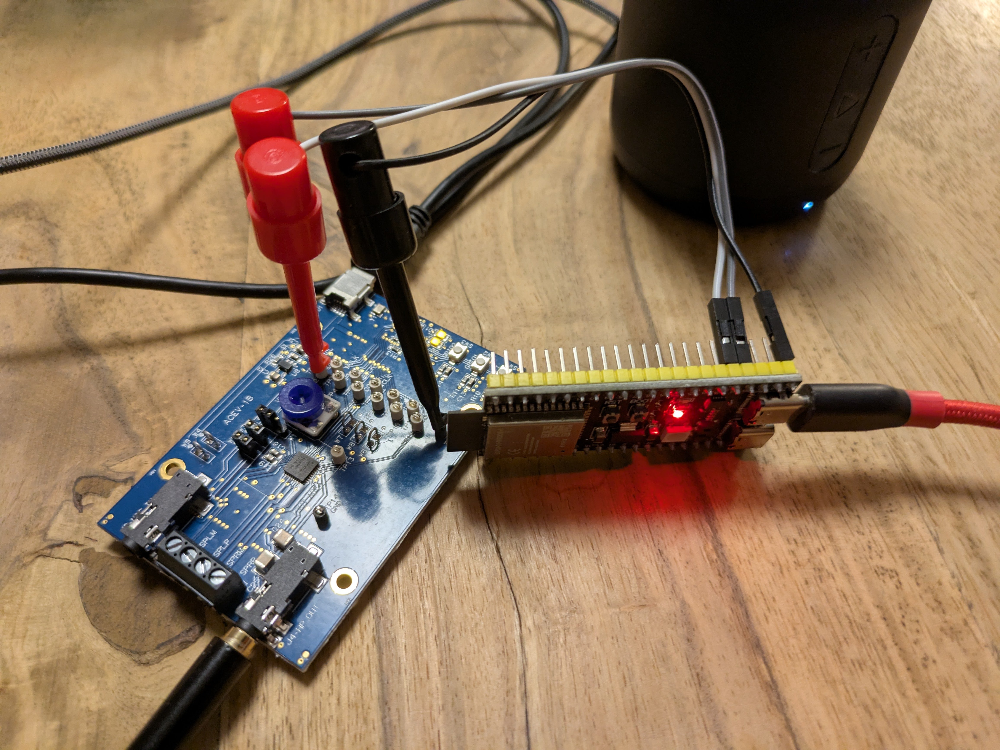

# TLV320AIC31xx codec configuration utility

This library allows configuration of the Texas Instruments TLV320AIC31xx codecs on Arduino platforms. It has been tested with the TLV320AIC3100 on a ACEV-1B eval board (i2c test points and ground hooked up to an esp32 dev kit board). It does not support all codec functions yet (like mic AGC) and likely has some rough edges.

## Host simulation

Host simulation uses a register map instead of i2c. This is initialized with the default values as per datasheet. Just run `make` to compile the `codec_simulator` binary from `examples/main.cpp`. Any register operations will be printed to stdout:
~~~
INFO Set Page: 1
Read  Reg:031 (Binary: 0b00000100) Value: 0x04 AIC31XX_HPDRIVER
Write Reg:031 (Binary: 0b11000100) Value: 0xc4 AIC31XX_HPDRIVER
Read  Reg:040 (Binary: 0b00000010) Value: 0x02 AIC31XX_HPLGAIN
Write Reg:040 (Binary: 0b00000110) Value: 0x06 AIC31XX_HPLGAIN
~~~

## PIO

The `platformio.ini` should be self-explantory. I2C pins are defined as build flags.

## Example

The setup method in `examples/main.cpp` shows all required calls to enable DAC, headphone, speakers, clocking via PLL from BLCK for 44,1kHz 16bit.

## Integration in platform.io project

Usage of this library is straightforward. Add the library to the `lib_deps`:
~~~
lib_deps=
	https://github.com/haklein/tlv320aic31xx.git
~~~
Include the header file and instantiate the class:
~~~
#include "tlv320aic31xx_codec.h"

TLV320AIC31xx codec(&Wire);
~~~

Call the `initialize()` method to reset the codec after setting up TwoWire:
~~~
    Wire.begin(SDA_PIN, SCL_PIN);
    codec.initialize();
~~~

